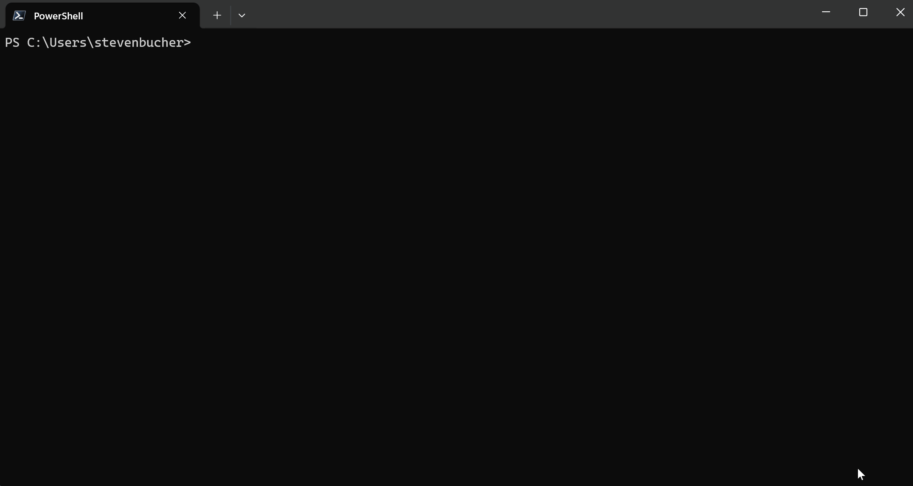

# MVP AI Shell Build

Hello MVPs! We are excited to share with you an early build of AI Shell!

Follow these brief steps to download and install AI Shell on your device:
1. Be sure you have Azure CLI installed and logged in using the `az login` command
2. For the best experience please download and utilize PowerShell 7 in Windows Terminal
3. Find your computer’s architectures package zip in this repo, download it and `AIShell-Module.zip`
   file. Currently this repo only supports the Windows architecture. In the real release Mac and
   Linux will also be provided.

> Note: Be sure to download BOTH zip files!

4. Unzip both and save them to a known location
5. Unblock both files – Right click on the file and in propteries, check the unblock box.
 
6. In PowerShell 7 run Import-Module <Path to AISH Module>\AIShell\

For example: `Import-Module C:\Users\stevenbucher\AIShellBuild\AIShell\`

7. Now run `Start-AIShell -Path <Path to AISH>/aish.exe`

[optional] For ease of use you can also add the path to aish.exe to your PATH environment variable and then just use Start-AIShell

Once launched you have the choice between two different agents; `openai-gpt` and `azure`. For this
MVP build, we would appreciate you testing with the `azure` agent. You are welcome to try the
openai-gpt but will need to provide your own Azure OpenAI details or OpenAI API key.

